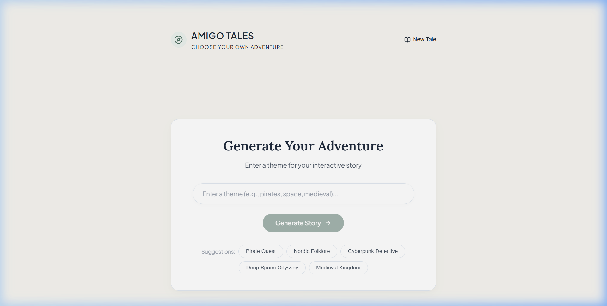
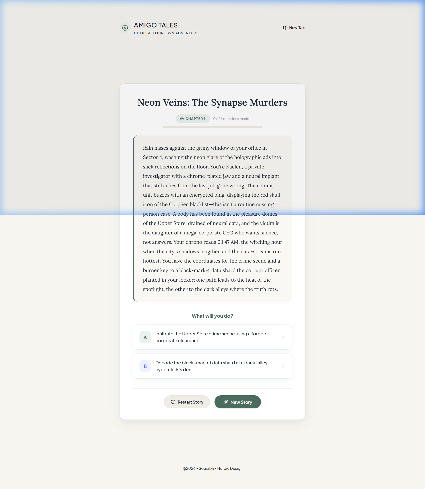
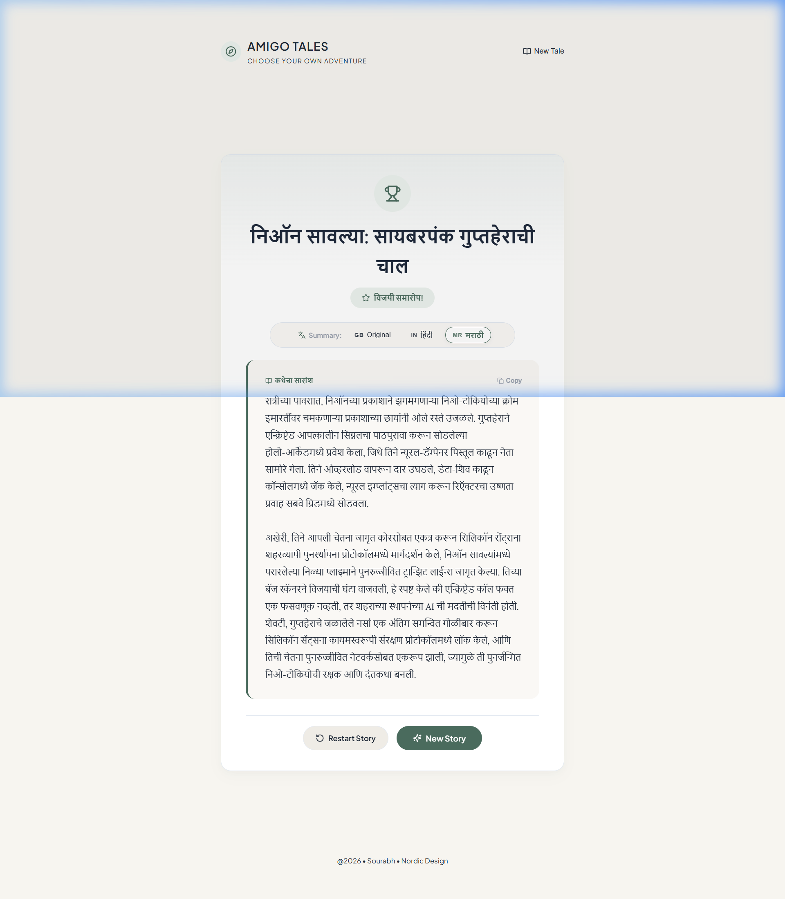
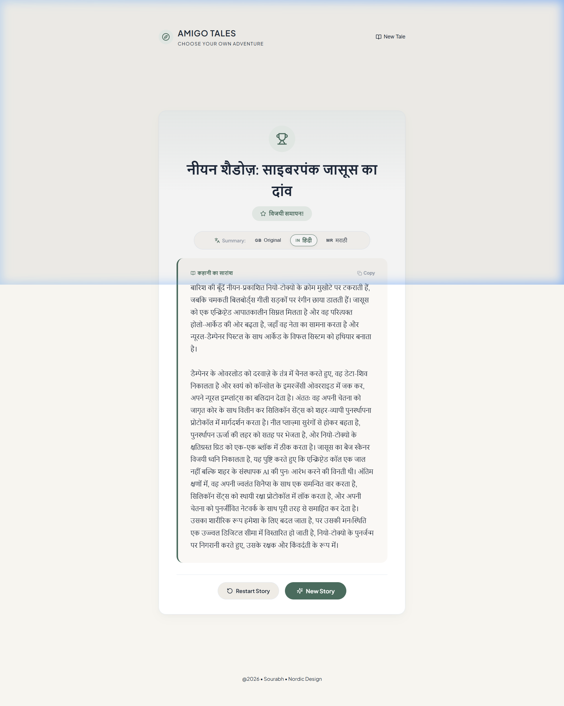

# Amigo Tales 🧭✨
### Choose Your Own Adventure AI Game Engine

**Amigo Tales** is an interactive, full-stack Choose Your Own Adventure (CYOA) story generation engine. Built with a Scandinavian Nordic design system, it dynamically generates branching narrative paths using LLMs, guides choices with sentence embeddings, and translates completed story summaries into **Marathi (मराठी)** and **Hindi (हिंदी)**.

---

## 📸 Screenshots & Demo

### 1. Home Screen & Theme Selection
Choose from curated adventure themes or enter your own custom universe.


### 2. Interactive Story Gameplay & Dynamic Choices
Deep branching narrative paths with chapter tracking and real-time LLM continuations.


### 3. Multilingual Ending Summary (Marathi - मराठी)
Full adventure journey translated and summarized in authentic Marathi with Devanagari script.


### 4. Multilingual Ending Summary (Hindi - हिंदी)
Instant language switching to Hindi translation.


---

## 🌟 Key Features

- 🌲 **Dynamic Branching Narratives**: Stories develop dynamically up to 6 decision levels deep, offering unique branching paths based on player choices.
- ⚡ **Ultra-Fast LLM Generation**: Powered by Groq API with multi-model fallback (`openai/gpt-oss-120b`, `openai/gpt-oss-20b`, `groq/compound-mini`, `groq/compound`).
- 🧠 **Vector Embedding Alignment**: Uses `all-MiniLM-L6-v2` semantic sentence embeddings to compute cosine similarity against target story endings.
- 🌐 **Multilingual Summary Translation**: Instantly translates and synthesizes the full adventure journey into **Marathi (मराठी)** or **Hindi (हिंदी)** in authentic Devanagari script upon reaching the finale.
- 🎨 **Nordic Design System**: Clean, warm linen aesthetic with Lora serif typography, smooth animations, and responsive layouts.
- ⏳ **Async Job Queue**: Background processing with status polling for seamless narrative generation without UI freezing.

---

## 🛠️ Tech Stack

### **Backend**
- **Framework**: FastAPI (Python 3.13+)
- **ORM & DB**: SQLAlchemy + SQLite
- **LLM Engine**: Groq API (`groq` Python SDK)
- **Embeddings**: `sentence-transformers` (`all-MiniLM-L6-v2`)
- **Server**: Uvicorn

### **Frontend**
- **Framework**: React 18
- **Build Tool**: Vite
- **Icons**: Lucide React
- **Styling**: Vanilla CSS (Nordic Design System)

---

## 📂 Project Structure

```
project_1/
├── backend/
│   ├── core/              # Config & environment settings
│   ├── db/                # Database engine & session management
│   ├── models/            # SQLAlchemy database models (Story, StoryNode, StoryJob)
│   ├── routers/           # FastAPI API routes (story, job)
│   ├── schemas/           # Pydantic validation schemas
│   ├── services/          # Story generation & translation engine
│   ├── .env.example       # Example environment variables template
│   ├── main.py            # FastAPI application entrypoint
│   └── pyproject.toml     # Backend dependencies
├── docs/
│   └── screenshots/       # Application UI screenshots for README
├── frontend/
│   ├── src/
│   │   ├── components/    # React UI components (Header, ThemeInput, StoryCard, EndingCard)
│   │   ├── App.jsx        # Main application state & gameplay loop
│   │   ├── index.css      # Nordic design system tokens & styles
│   │   └── main.jsx       # React entry point
│   ├── index.html         # Web entry point
│   ├── package.json       # Frontend dependencies
│   └── vite.config.js     # Vite configuration
├── .gitignore             # Root git ignore
└── README.md              # Project documentation
```

---

## 🚀 Quick Start Guide

### Prerequisites
- Python 3.10+ (or 3.13+)
- Node.js 18+ and npm
- A Groq API key from [Groq Console](https://console.groq.com)

---

### 1. Backend Setup

```bash
# Navigate to backend directory
cd backend

# Create and activate a virtual environment
python -m venv .venv

# On Windows:
.venv\Scripts\activate
# On macOS/Linux:
source .venv/bin/activate

# Install dependencies
pip install -r pyproject.toml
# Or with uv:
uv sync

# Configure environment variables
cp .env.example .env
```

Open `.env` in the `backend/` directory and enter your Groq API key:
```env
GROQ_API_KEY=your_groq_api_key_here
DATABASE_URL=sqlite:///./database.db
API_PREFIX=/api
DEBUG=True
ALLOWED_ORIGINS=http://localhost:5173,http://127.0.0.1:5173
```

Start the backend server:
```bash
uvicorn main:app --reload --port 8000
```
API Documentation will be available at: `http://localhost:8000/docs`

---

### 2. Frontend Setup

In a new terminal window:
```bash
# Navigate to frontend directory
cd frontend

# Install npm dependencies
npm install

# Start development server
npm run dev
```

Open your browser at `http://localhost:5173` to play!

---

## 📡 API Endpoints Overview

| Method | Endpoint | Description |
|---|---|---|
| `POST` | `/api/stories/create` | Starts a background job to generate a new story opening |
| `GET` | `/api/jobs/{job_id}` | Polls the status of story generation job |
| `GET` | `/api/stories/{story_id}/complete` | Returns the complete initial story graph |
| `GET` | `/api/stories/{story_id}/nodes/{node_id}` | Traverses to and dynamically generates options for a story node |
| `POST` | `/api/stories/{story_id}/translate` | Generates a complete adventure summary in Marathi or Hindi |

---

## 📜 License

Created with ❤️ by **@2026 • Sourabh • Nordic Design**.
